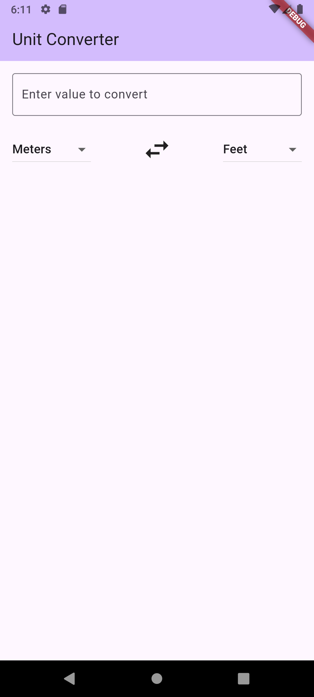
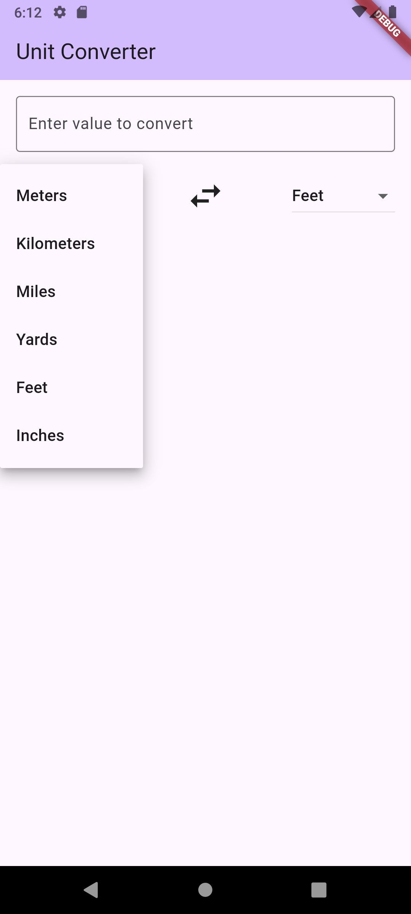
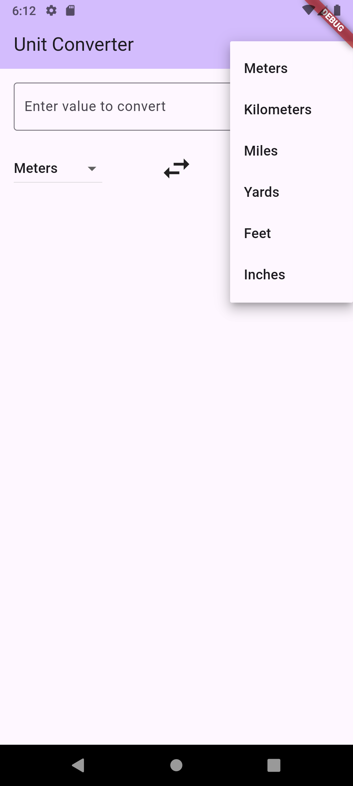

# Unit Converter

A simple and intuitive unit converter application built with Flutter.

## Features

- Convert between various units of length.
- Supported units: Meters, Kilometers, Miles, Yards, Feet, and Inches.
- Real-time conversion as you type.
- Clean user interface with dropdowns for easy unit selection.

## Screenshots

To display your screenshots, you can place them in a folder (e.g., `assets/images` or `screenshots`) in your project's root directory and then reference them here.

| Input & Conversion | From Unit Selection | To Unit Selection |
|:------------------:|:-------------------:|:-----------------:|
| |  |  |

## Getting Started

To get a local copy up and running, follow these simple steps.

### Prerequisites

Make sure you have the Flutter SDK installed on your machine.
- Flutter installation guide

### Installation

1.  Clone the repository:
    ```sh
    git clone https://github.com/your_username/unit_converter.git
    ```
2.  Navigate to the project directory and install dependencies:
    ```sh
    flutter pub get
    ```
3.  Run the app:
    ```sh
    flutter run
    ```
